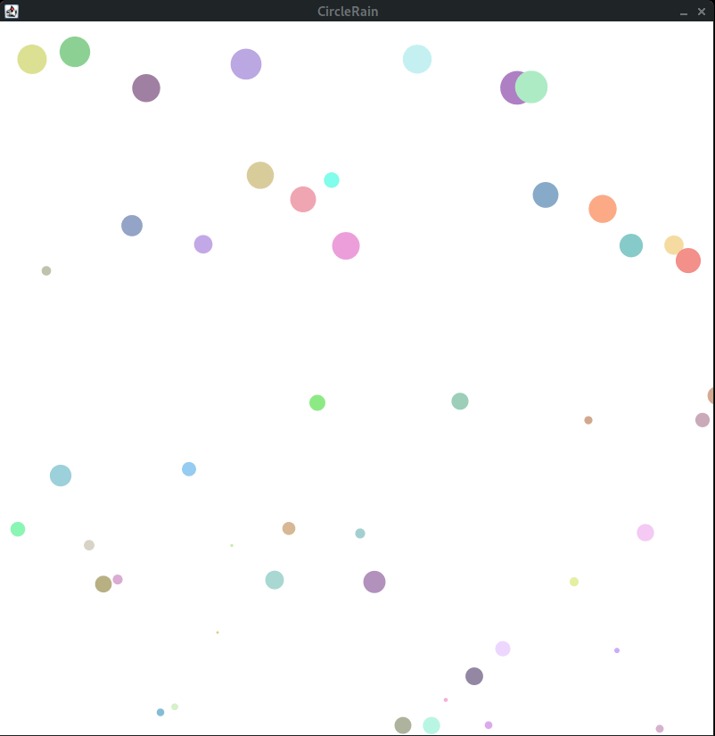

# U17 | CircleRainWithClasses

In dieser Aufgabe wird CircleRain aus [U14](https://oop-wintersemester-2021.github.io/AssignmentViewer-OOP/#OOP-Wintersemester-2021/U14-CircleRain) einem `Refactoring` unterzogen: 
Als Ausgangspunkt wird der Lösungsvorschlag von U14 verwendet.
In U14 werden zwei Arrays verwendet:
- `private Circle[] circles`
- `private float[] circleSpeeds`

Die Werte beider Arrays beziehen sich allerdings logisch auf ein Element.
Um die Struktur des Programms zu verbessern, sollen beide Arrays mit einem einzigen Array, das Objekte der Klasse `RainDrop` speichert, ersetzt werden.
- Die Klasse `RainDrop` enthält den Kreis, der gezeichnet werden soll und die Geschwindigkeit mit der dieser sich zum unteren Rand der Zeichenfläche bewegt.
- das bisherige Verhalten eines Objekts der Klasse `RainDrop` soll erweitert werden.
- mit fortschreitender Falldauer, soll der Kreis eines `RainDrop` immer kleiner werden (d.h. der Radius des Kreises wird kleiner)
- es soll einmalig ein zufälliger Wert für die Rate der Abnahme der Größe des Kreises bestimmt werden
- legen Sie dazu notwendige Variablen und Methoden in der Klasse `RainDrop` an.

Die Klasse `CircleRain` wird nur verwendet, um die Methoden `draw()` und `update()` von Objekten der Klasse `RainDrop` aufzurufen und um selbige Objekte zu erstellen. Sonst wird jegliche Logik in der Klasse `RainDrop` implementiert. 

